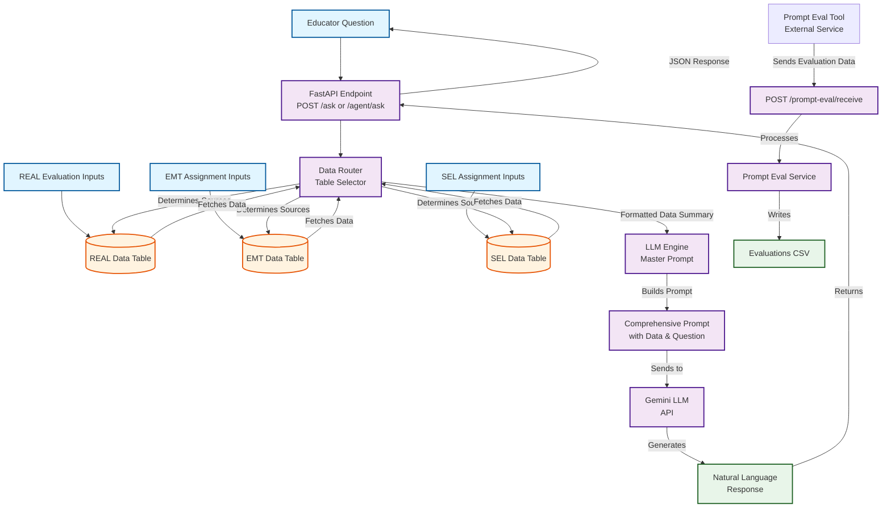
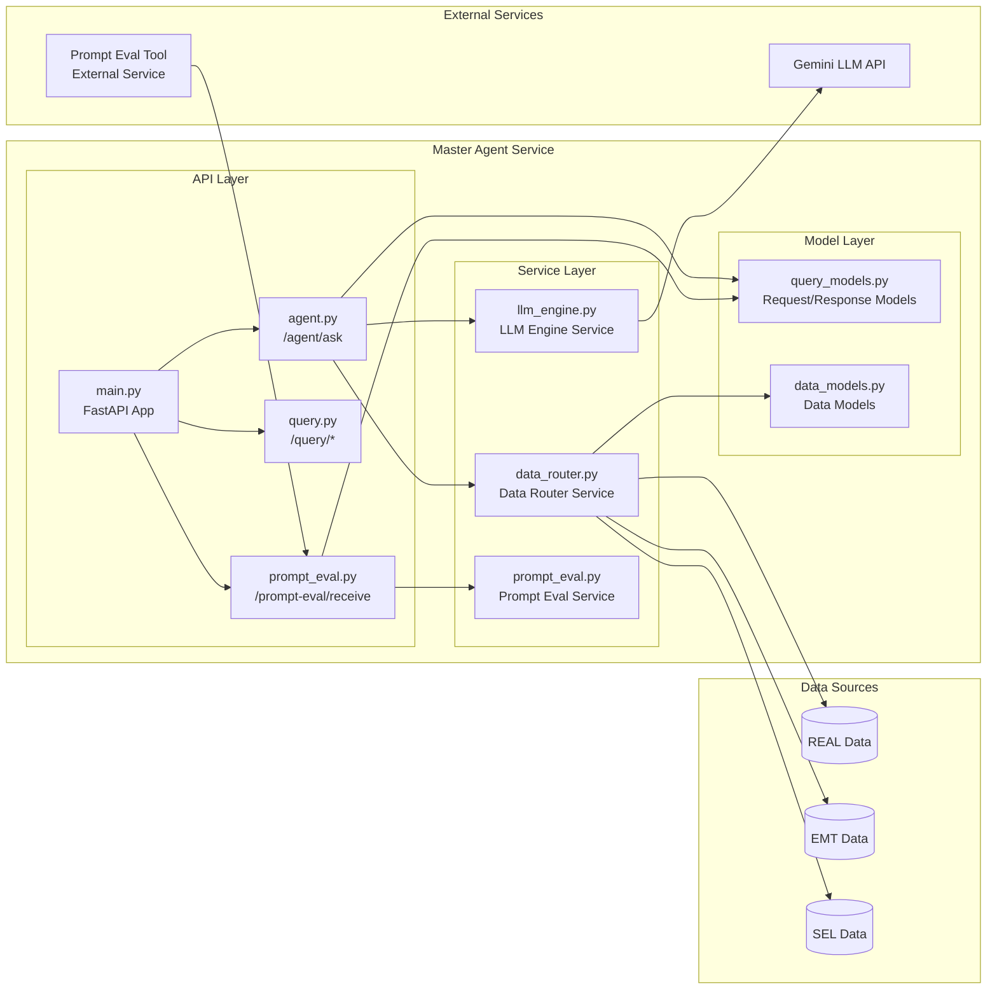
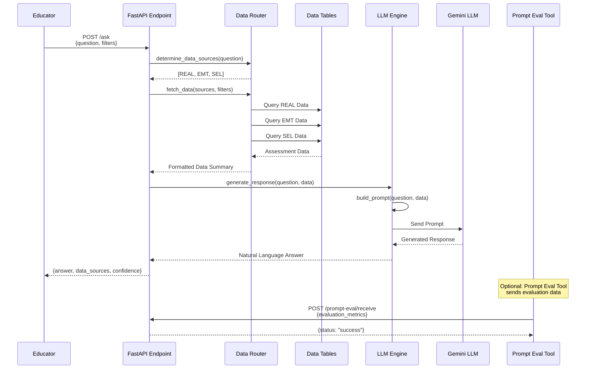
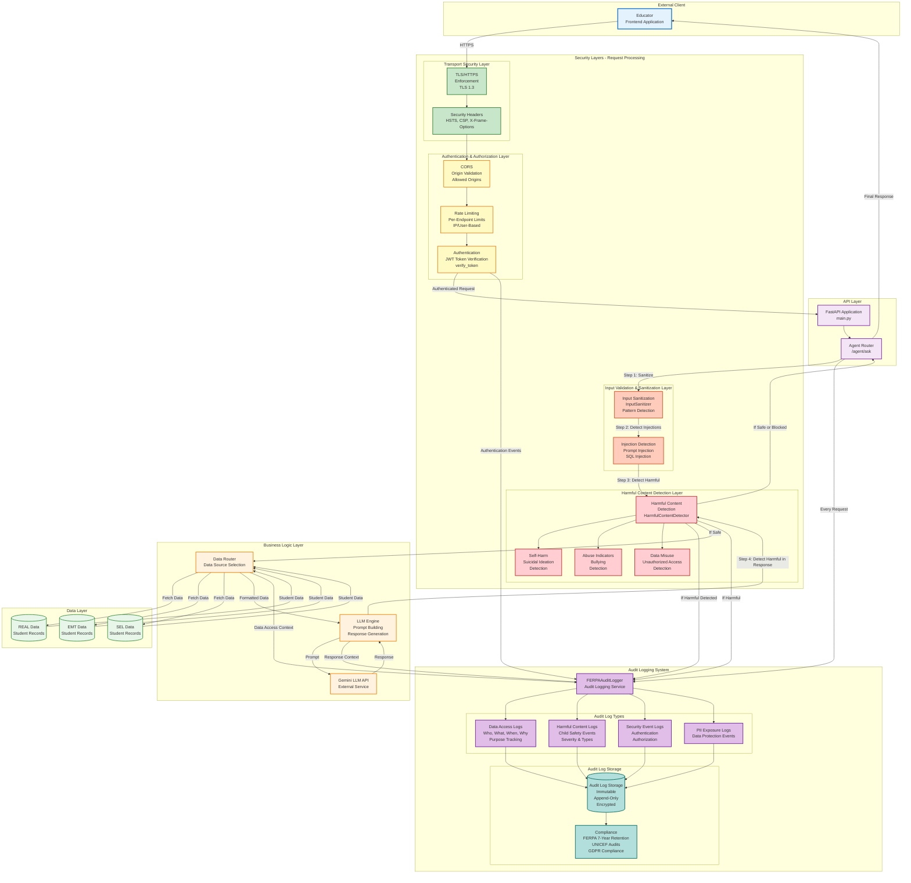
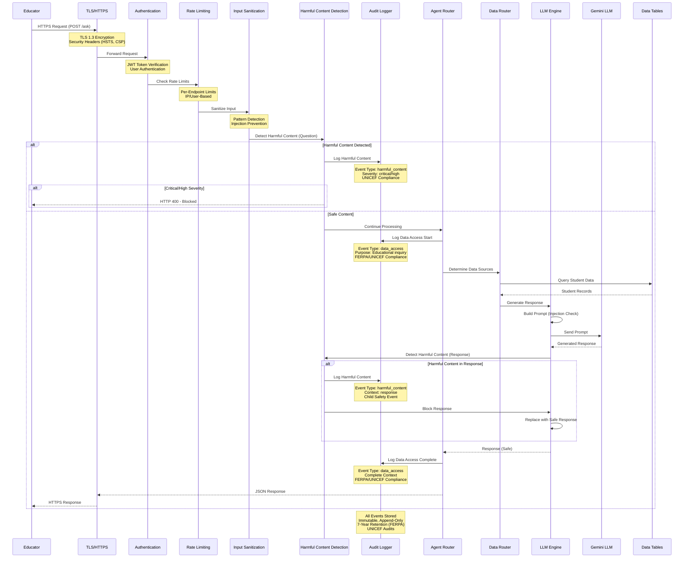

# Master Agent for Tilli

The Master Agent is a backend service that reads from multiple assessment tables (REAL Data, EMT Data, SEL Data) and answers educator questions by combining structured data with LLM-generated insights.

## Architecture

The Master Agent follows this architecture:

### Master Chatbot Architecture Overview

```mermaid
graph TB
    subgraph "External Clients & Services"
        Educator[Educator<br/>Frontend Application]
        EvalTool[Prompt Eval Tool<br/>External Service]
    end
    
    subgraph "Master Agent API Layer"
        direction TB
        FastAPI[FastAPI Application<br/>main.py]
        
        subgraph "Routers"
            AgentRouter[Agent Router<br/>/agent/ask<br/>POST /ask]
            QueryRouter[Query Router<br/>/query/*]
            EvalRouter[Prompt Eval Router<br/>/prompt-eval/receive]
        end
        
        subgraph "Request/Response Models"
            AskRequest[AskRequest<br/>AskResponse]
            QueryModels[Query Models]
            EvalModels[PromptEvalRequest<br/>PromptEvalResponse]
        end
    end
    
    subgraph "Service Layer - Core Business Logic"
        direction TB
        
        subgraph "Data Routing Service"
            DataRouter[Data Router Service<br/>data_router.py]
            SourceSelector[Source Selector<br/>Keyword Matching]
            DataFormatter[Data Formatter<br/>format_data_for_llm]
        end
        
        subgraph "LLM Service"
            LLMEngine[LLM Engine Service<br/>llm_engine.py]
            PromptBuilder[Prompt Builder<br/>build_prompt]
            ResponseGenerator[Response Generator<br/>generate_response]
        end
        
        subgraph "Evaluation Service"
            PromptEval[Prompt Eval Service<br/>prompt_eval.py]
            EvalProcessor[Evaluation Processor]
        end
    end
    
    subgraph "External AI Services"
        GeminiAPI[Google Gemini API<br/>gemini-1.5-pro<br/>HTTPS REST API]
    end
    
    subgraph "Data Layer - Assessment Tables"
        direction TB
        REALDB[(REAL Data Table<br/>Remote Learning<br/>Assessment Results)]
        EMTDB[(EMT Data Table<br/>Emotion Matching<br/>Task Results)]
        SELDB[(SEL Data Table<br/>Social-Emotional<br/>Learning Results)]
    end
    
    subgraph "Data Sources - Input Systems"
        REALInput[REAL Evaluation<br/>Input System]
        EMTInput[EMT Assignment<br/>Input System]
        SELInput[SEL Assignment<br/>Input System]
    end
    
    subgraph "Output & Storage"
        EvaluationsCSV[(Evaluations CSV<br/>Evaluation Metrics)]
        Logs[Application Logs<br/>& Monitoring]
    end
    
    %% Client to API connections
    Educator -->|HTTP POST<br/>Questions| AgentRouter
    Educator -->|HTTP GET<br/>Testing| QueryRouter
    EvalTool -->|HTTP POST<br/>Evaluation Data| EvalRouter
    
    %% API Layer internal connections
    FastAPI --> AgentRouter
    FastAPI --> QueryRouter
    FastAPI --> EvalRouter
    
    AgentRouter --> AskRequest
    EvalRouter --> EvalModels
    QueryRouter --> QueryModels
    
    %% Router to Service connections
    AgentRouter -->|determine_data_sources<br/>fetch_data| DataRouter
    AgentRouter -->|generate_response| LLMEngine
    EvalRouter -->|process_evaluation| PromptEval
    
    %% Service Layer internal connections
    DataRouter --> SourceSelector
    DataRouter --> DataFormatter
    LLMEngine --> PromptBuilder
    LLMEngine --> ResponseGenerator
    PromptEval --> EvalProcessor
    
    %% Service to External Services
    LLMEngine -->|HTTPS API Call<br/>Prompt + Data| GeminiAPI
    GeminiAPI -->|Generated Response<br/>Natural Language| ResponseGenerator
    
    %% Service to Data Layer
    SourceSelector -->|Query| REALDB
    SourceSelector -->|Query| EMTDB
    SourceSelector -->|Query| SELDB
    DataFormatter -->|Formatted Data| PromptBuilder
    
    %% Data Source to Data Layer
    REALInput -->|Writes| REALDB
    EMTInput -->|Writes| EMTDB
    SELInput -->|Writes| SELDB
    
    %% Service to Output
    EvalProcessor -->|Writes| EvaluationsCSV
    FastAPI -->|Logs| Logs
    LLMEngine -->|Logs| Logs
    DataRouter -->|Logs| Logs
    
    %% Styling
    classDef clientStyle fill:#e3f2fd,stroke:#1976d2,stroke-width:3px
    classDef apiStyle fill:#f3e5f5,stroke:#7b1fa2,stroke-width:2px
    classDef serviceStyle fill:#fff3e0,stroke:#f57c00,stroke-width:2px
    classDef dataStyle fill:#e8f5e9,stroke:#388e3c,stroke-width:2px
    classDef externalStyle fill:#fce4ec,stroke:#c2185b,stroke-width:2px
    classDef outputStyle fill:#f1f8e9,stroke:#689f38,stroke-width:2px
    
    class Educator,EvalTool clientStyle
    class FastAPI,AgentRouter,QueryRouter,EvalRouter,AskRequest,QueryModels,EvalModels apiStyle
    class DataRouter,SourceSelector,DataFormatter,LLMEngine,PromptBuilder,ResponseGenerator,PromptEval,EvalProcessor serviceStyle
    class REALDB,EMTDB,SELDB,REALInput,EMTInput,SELInput dataStyle
    class GeminiAPI externalStyle
    class EvaluationsCSV,Logs outputStyle
```



### System Flow Diagram



### Component Architecture Diagram



### Request Flow Sequence



**Data Sources:**
- **REAL Data**: Remote Learning Assessment results from REAL Evaluation inputs
- **EMT Data**: Emotion Matching Task results from EMT Assignment inputs  
- **SEL Data**: Social-Emotional Learning results from SEL Assignment inputs

**Core Components:**
- **Data Router / Table Selector**: Routes questions to appropriate data tables
- **Master Prompt (LLM Engine)**: Constructs prompts with data and sends to Gemini LLM
- **Prompt Eval Tool Integration**: Receives evaluation data from external Prompt Eval Tool service

---

### Security Architecture & Audit Logging Diagram



**Security Layers Explained:**

1. **Transport Security Layer**
   - TLS/HTTPS enforcement (TLS 1.3)
   - Security headers (HSTS, CSP, X-Frame-Options)
   - Encrypted communication

2. **Authentication & Authorization Layer**
   - JWT token verification
   - Rate limiting (per-endpoint, IP/user-based)
   - CORS origin validation

3. **Input Validation & Sanitization Layer**
   - Input sanitization (pattern detection)
   - Injection detection (prompt injection, SQL injection)
   - Character validation and normalization

4. **Harmful Content Detection Layer**
   - Self-harm and suicidal ideation detection
   - Abuse indicators and bullying detection
   - Data misuse and unauthorized access detection
   - Critical/High severity content blocking

5. **Audit Logging System**
   - Data access logs (who, what, when, why - purpose tracking)
   - Harmful content logs (child safety events)
   - Security event logs (authentication, authorization)
   - PII exposure logs (data protection events)
   - Immutable, append-only storage (FERPA/UNICEF compliant)

---

### Security Flow Sequence Diagram



**Security Flow Steps:**

1. **TLS/HTTPS** - Encrypted transport, security headers
2. **Authentication** - JWT token verification
3. **Rate Limiting** - Prevents abuse, DoS protection
4. **Input Sanitization** - Validates and sanitizes input
5. **Harmful Content Detection** - Scans question for harmful content
   - If harmful: Logs to audit trail, blocks if critical/high
   - If safe: Continues processing
6. **Audit Logging** - Logs data access with purpose (FERPA/UNICEF)
7. **Data Access** - Fetches student data
8. **LLM Processing** - Generates response (with injection protection)
9. **Response Security** - Scans LLM response for harmful content
   - If harmful: Logs to audit trail, blocks response
   - If safe: Returns response
10. **Final Audit Log** - Logs complete data access context

## Overview

The Master Agent serves as an intelligent interface between educators and Tilli's assessment data. When an educator asks a question about student performance, the agent:

1. **Parses the question** - Understands what the educator is asking
2. **Routes to data sources** - Data Router determines which assessment tables (REAL, EMT, SEL) are relevant
3. **Fetches data** - Retrieves data from the selected tables
4. **Formats for LLM** - Master Prompt constructs a comprehensive prompt with the data
5. **Generates insights** - Sends prompt to Gemini LLM to create natural-language responses
6. **Returns actionable information** - Provides intervention ideas, insights, and trends
7. **Optional evaluation** - Can send prompts to Prompt Eval Tool for evaluation tracking

## Project Structure

```
master-agent/
├── app/
│   ├── main.py                 # FastAPI application entry point
│   ├── routers/
│   │   ├── agent.py           # Main /ask endpoint router
│   │   └── query.py           # Query testing endpoints
│   ├── services/
│   │   ├── data_router.py     # Data source routing logic
│   │   └── llm_engine.py      # LLM prompt generation and calls
│   └── models/
│       ├── query_models.py    # API request/response models
│       └── data_models.py     # Assessment data structure models
├── tests/
│   └── test_agent.py          # Unit and integration tests
├── README.md
└── requirements.txt
```

## Getting Started

### Installation

1. Navigate to the master-agent directory:
   ```bash
   cd master-agent
   ```

2. Create a virtual environment (recommended):
   ```bash
   python -m venv venv
   source venv/bin/activate  # On Windows: venv\Scripts\activate
   ```

3. Install dependencies:
   ```bash
   pip install -r requirements.txt
   ```

4. Configure Gemini API key (optional, but recommended):
   ```bash
   export GEMINI_API_KEY="your-api-key-here"
   ```
   
   **Note:** If the Gemini API key is not configured, the service will use mock responses for testing. To get a Gemini API key:
   - Visit [Google AI Studio](https://makersuite.google.com/app/apikey)
   - Create a new API key
   - Set it as an environment variable or add to your `.env` file

### Running the Service

Start the FastAPI server:

```bash
uvicorn app.main:app --reload --host 0.0.0.0 --port 8000
```

The service will be available at `http://localhost:8000`.

### API Documentation

Once the service is running, visit:
- **Interactive API docs**: `http://localhost:8000/docs`
- **Alternative docs**: `http://localhost:8000/redoc`

## API Endpoints

### POST /agent/ask

Main endpoint for educator questions.

**Request:**
```json
{
  "question": "How are my Grade 1 students doing in self-awareness?",
  "grade_level": "Grade 1",
  "student_id": "optional_student_id",
  "classroom_id": "optional_classroom_id"
}
```

**Response:**
```json
{
  "answer": "Based on the assessment data from SEL assignments, EMT...",
  "data_sources": ["SEL", "EMT"],
  "confidence": "high"
}
```

### GET /health

Health check endpoint.

**Response:**
```json
{
  "status": "healthy",
  "version": "0.1.0"
}
```

### GET /query/sources

Identify which data sources would be used for a question (useful for testing).

**Example:**
```
GET /query/sources?question=How are students doing in emotion matching?
```

### GET /query/test-data

Fetch test/mock data for specified sources (useful for development).

**Example:**
```
GET /query/test-data?sources=EMT,SEL,REAL
```

### POST /prompt-eval/receive

Receives evaluation data from the external Prompt Eval Tool service.

**Request:**
```json
{
  "prompt": "The full prompt that was evaluated",
  "question": "Original educator question",
  "response": "LLM response that was evaluated",
  "data_summary": {...},
  "evaluation_metrics": {...},
  "timestamp": "2024-01-01T12:00:00"
}
```

**Response:**
```json
{
  "status": "success",
  "message": "Evaluation data received and processed successfully"
}
```

**Note:** This endpoint receives data FROM the Prompt Eval Tool (external service), not the other way around.

## How It Works

### Data Routing

The `DataRouter` service (Table Selector) uses keyword matching to determine which assessment tables are relevant to a question:

- **EMT Data (Emotion Matching Task)**: Triggered by keywords like "emotion", "emotion matching", "emt", "emotion assignment"
- **REAL Data (Remote Learning Assessment)**: Triggered by keywords like "remote learning", "real", "real evaluation", "academic performance"
- **SEL Data (Social-Emotional Learning)**: Triggered by keywords like "sel", "sel assignment", "self-awareness", "self-management", "social awareness"

**TODO**: Replace keyword matching with more sophisticated NLP/ML-based routing once requirements are clearer.

### LLM Prompting

The `LLMEngine` service implements the **Master Prompt** component:

1. Receives formatted data from the Data Router
2. Constructs a comprehensive prompt that includes:
   - The educator's question
   - Formatted assessment data from relevant sources (REAL, EMT, SEL)
   - Instructions for generating actionable insights

3. Sends prompt to **Gemini LLM** (integrated)
   - ✅ Gemini API integration implemented
   - ✅ Automatically uses Gemini API if `GEMINI_API_KEY` environment variable is set
   - ✅ Falls back to mock responses if API key is not configured or API call fails
   - Default model: `gemini-1.5-pro` (configurable via `model_name` parameter)

4. Optionally sends to **Prompt Eval Tool** for evaluation tracking
   - **TODO**: Configure Prompt Eval Tool integration
   - **TODO**: Implement Evaluations CSV generation

5. Returns natural-language responses with:
   - Data-driven insights
   - Intervention ideas
   - Trend analysis
   - Recommendations

## Data Models

### Assessment Data Sources

Based on the Master Agent architecture:

- **REAL Data**: Results from REAL Evaluation inputs
- **EMT Data**: Results from EMT Assignment inputs
- **SEL Data**: Results from SEL Assignment inputs

**Note**: Current data models are placeholders. Actual database schemas will be integrated once provided. The data flows from assessment inputs → tables → Data Router → Master Prompt → Gemini LLM.

## Testing

Run the test suite:

```bash
pytest tests/
```

Or with coverage:

```bash
pytest tests/ --cov=app --cov-report=html
```

## Integration Pathway

### Current State

The Master Agent currently:
- ✅ Accepts educator questions via API
- ✅ Routes questions to appropriate data sources (keyword-based)
- ✅ Returns mock/placeholder data
- ✅ Generates contextual responses (mock LLM)

### Next Steps for Production

1. **Database Integration**
   - [ ] Obtain actual database schemas for REAL Data, EMT Data, and SEL Data tables
   - [ ] Replace mock data in `data_router.py` with actual SQL queries
   - [ ] Add database connection pooling and error handling
   - [ ] Implement proper data filtering by grade_level, student_id, classroom_id

2. **Gemini LLM Integration**
   - [x] Gemini API integration implemented in `llm_engine.py`
   - [x] Automatic fallback to mock responses if API unavailable
   - [x] Error handling and logging implemented
   - [ ] Fine-tune prompts based on real usage
   - [ ] Add response validation and rate limiting

3. **Prompt Eval Tool Integration** (Optional)
   - [ ] Configure Prompt Eval Tool
   - [ ] Implement prompt evaluation tracking
   - [ ] Generate Evaluations CSV output

4. **Advanced Routing**
   - [ ] Replace keyword matching with NLP-based routing
   - [ ] Add learning from question patterns
   - [ ] Implement confidence scoring for data source selection

5. **Integration with SEAL, AskTilli, and Dashboard**
   - [ ] Define API contracts with other Tilli services
   - [ ] Add authentication/authorization
   - [ ] Implement rate limiting and caching
   - [ ] Add logging and monitoring

## Extending the Master Agent

### Adding a New Data Source

1. Add data model in `app/models/data_models.py`
2. Add keywords in `app/services/data_router.py`
3. Implement data fetching logic in `data_router.fetch_data()`
4. Update `format_data_for_llm()` to include new source

### Customizing LLM Prompts

Modify `llm_engine.build_prompt()` to adjust the prompt structure. The current prompt includes:
- Context about the Master Agent role
- The educator's question
- Formatted assessment data
- Instructions for response generation

### Adding New Endpoints

1. Create a new router file in `app/routers/`
2. Define endpoints using FastAPI decorators
3. Include the router in `app/main.py`

## Security Considerations

**⚠️ IMPORTANT: Security review required before production deployment.**

The Master Agent handles sensitive student assessment data and must be secured before production use. 

### Current Protection Level: **MODERATE (7/10)**

**✅ Well Protected:**
- Input validation & sanitization (9/10)
- Prompt injection protection (9/10)
- Rate limiting (8/10)
- Error handling (8/10)
- CORS configuration (7/10)

**⚠️ Needs Attention:**
- Authentication (4/10 → 8/10 when enabled) - **Currently optional by default**
- Authorization & data access control (2/10) - **Critical gap**
- PII protection in outputs (3/10) - **Limited**

**❌ Not Protected:**
- Data access control - No permission checks for student/classroom access
- PII redaction in responses - LLM responses may contain PII
- Audit logging - Basic, not FERPA-compliant

**✅ Transport Security:**
- TLS enforcement middleware implemented
- HSTS headers with configurable max-age
- HTTP to HTTPS redirect (automatic)
- Security headers (CSP, X-Frame-Options, etc.)
- Configure via `ENVIRONMENT=production` or `REQUIRE_TLS=true`
- See [TLS_CONFIGURATION.md](TLS_CONFIGURATION.md) for setup

### Quick Security Status

| Component | Status | Notes |
|-----------|--------|-------|
| Input Sanitization | ✅ Strong | 20+ injection patterns detected |
| Prompt Injection | ✅ Strong | Multi-layer defense |
| Rate Limiting | ✅ Good | Per-endpoint limits |
| Authentication | ⚠️ Optional | Set `ENABLE_AUTH=true` to enforce |
| Data Access Control | ❌ Missing | Critical: No permission checks |
| PII Protection | ❌ Limited | No output redaction |
| Harmful Content Detection | ✅ Implemented | UNICEF-aligned child protection |
| Transport Security | ✅ Implemented | Set `REQUIRE_TLS=true` for production |
| SQL Injection | ⚠️ N/A | Not applicable (mock data) |

### Before Production Deployment

**🔴 CRITICAL (Must Fix):**
1. Set `ENABLE_AUTH=true` to enforce authentication
2. Implement data access control (who can access which students)
3. Add PII redaction to LLM responses
4. Configure TLS/HTTPS:
   - Set `ENVIRONMENT=production` or `REQUIRE_TLS=true`
   - Configure reverse proxy for TLS termination
   - See [TLS_CONFIGURATION.md](TLS_CONFIGURATION.md)
5. Implement FERPA-compliant audit logging

**⚠️ IMPORTANT (Should Fix):**
6. Configure proper CORS origins
7. Use Redis for distributed rate limiting
8. Implement secret management (AWS Secrets Manager/Vault)
9. Add monitoring and alerting

**📚 Security Documentation:**
- [SECURITY.md](SECURITY.md) - Comprehensive threat analysis
- [SECURITY_ASSESSMENT.md](SECURITY_ASSESSMENT.md) - Detailed protection assessment
- [AUTHENTICATION_OPTIONS.md](AUTHENTICATION_OPTIONS.md) - IAM/authentication options
- [PRODUCTION_SECURITY.md](PRODUCTION_SECURITY.md) - **Production security guide (7 schools, 6,000 students)**
- [HARMFUL_CONTENT_DETECTION.md](HARMFUL_CONTENT_DETECTION.md) - **Harmful content detection & alerting (UNICEF child protection)**
- [AUDIT_LOGGING.md](AUDIT_LOGGING.md) - **FERPA & UNICEF-compliant audit logging**
- [EXTERNAL_API_SECURITY.md](EXTERNAL_API_SECURITY.md) - **External API security (Gemini API, API key management, rate limiting)**
- [TLS_CONFIGURATION.md](TLS_CONFIGURATION.md) - TLS/HTTPS setup guide
- [KNOWN_KEY_VALUES.md](KNOWN_KEY_VALUES.md) - All data structures documented

## Development Notes

- **Placeholder Data**: Current implementation uses mock data. Look for `TODO` comments marking where actual integration should occur.
- **No Schema Assumptions**: The code intentionally avoids assuming database structure to maintain flexibility.
- **Modular Architecture**: Services are separated to allow easy replacement of routing and LLM logic.

## License

This project is part of the Tilli platform.

## Support

For questions or issues, please contact the Tilli development team.

